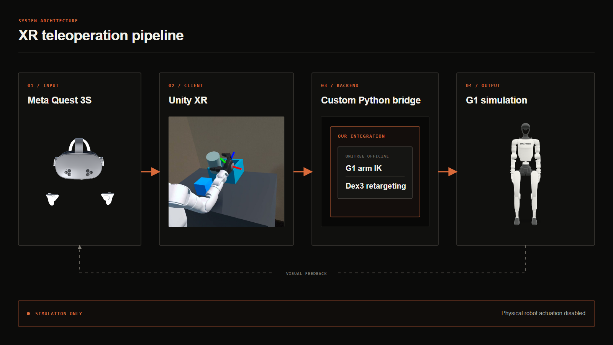

# G1 XR Teleoperation

Simulation-only humanoid teleoperation for the Unitree G1, built with Unity, Meta Quest 3S, and a Python/WSL2 robotics backend. The system maps tracked wrists, Touch controller input, or optical hand keypoints to a 29-DoF G1 digital twin with Dex3 hands, while keeping physical-robot actuation explicitly outside the software boundary.

[Portfolio case study](https://jonymorse.com/teleop/) | [Demo video](captures/quest3/2026-07-13/com.warmgarbege.xrteleoperation-20260713-211606-0_clip-12m10s-12m50s.mp4) | [Backend notes](tools/g1_backend/README.md)



## At a glance

| Area | Current implementation |
| --- | --- |
| Status | Functional simulation prototype; no physical robot output |
| Operator hardware | Meta Quest 3S with Touch controllers or optical hand tracking |
| Robot model | Unitree G1 `g1_29dof_mode_11` with 14 arm joints and two 7-DoF Dex3 hands |
| XR client | Unity 6, OpenXR, Meta XR SDK, passthrough, Android |
| Robotics backend | Custom transport and calibration layer around Unitree's official G1 arm IK and Dex3 retargeting |
| Transport | Versioned JSON over UDP at 30 Hz; 350 ms stale-connection threshold |
| Simulation | Unity digital twin, contact-qualified grasping, tabletop task environment |

## What is implemented

- Bilateral arm teleoperation from Touch controllers, including wrist-orientation calibration, warm-start reset, smoothing, and joint-limit validation.
- Optical Quest hand tracking with 25 keypoints per hand and Dex3 finger retargeting.
- Direct controller finger input for thumb, index, and power-grasp control.
- Head-relative workspace setup with independent robot and table alignment modes.
- Navigation and an optional egocentric camera mounted at the robot's head.
- A mode-aware HUD that reports control state, backend connectivity, and tracking state.
- A tabletop manipulation task with a cube, cylinder, and receptacle.
- Contact-qualified grasps using opposing-finger and palm contacts, breakable Unity joints, slip/release behavior, bounded release velocity, and haptic feedback.
- Command gating for tracking loss, mode changes, stale backend data, invalid packets, and operator pause.

## System architecture

```text
Meta Quest 3S
  headset, Touch controllers, optical hands
                |
                | poses, controls, hand keypoints
                v
Unity XR client (Android)
  modes, calibration, HUD, safety gates, digital twin, task physics
                |
                | JSON / UDP 7447-7448 at 30 Hz
                v
Windows relay
                |
                | UDP 7547 over WSL localhost
                v
Python backend (Ubuntu 22.04 / WSL2)
  coordinate conversion, filtering, validation, solver lifecycle
                |
                v
Unitree G1_29_ArmIK + Dex3 HandRetargeting
                |
                | 14 arm + 14 hand joint targets
                v
Unity G1 digital twin only
```

Unity uses right/up/forward coordinates. The backend converts these to Unitree's forward/left/up convention before solving. A request contains two wrist transforms, the current 14-joint arm state, and, when hand retargeting is active, 25 three-dimensional keypoints for each hand. A valid response contains 14 arm targets and optionally 14 Dex3 hand targets, all in radians.

The Windows relay exists because WSL2 does not reliably receive subnet UDP broadcasts. It exposes ports 7447 and 7448 to the Quest and forwards solver traffic to WSL localhost port 7547.

## Implementation ownership

This project is an integration, interaction, and simulation layer. It does not claim authorship of Unitree's numerical solvers.

| Custom implementation in this repository | Upstream Unitree implementation |
| --- | --- |
| Quest/Unity control modes and input mapping | `G1_29_ArmIK` numerical arm solver |
| Versioned Unity-to-Python UDP protocol | `HandRetargeting` for `HandType.UNITREE_DEX3` |
| Windows-to-WSL2 relay and process launcher | G1 and Dex3 robot descriptions and meshes |
| Unity-to-Unitree coordinate conversion | Solver dependencies and model configuration |
| Wrist neutral calibration and solver reset |  |
| Filtering, packet validation, timeouts, and simulation-only gate |  |
| Digital-twin control, HUD, alignment, task physics, and grasp model |  |

The backend imports the solver and retargeter from Unitree's [`xr_teleoperate`](https://github.com/unitreerobotics/xr_teleoperate) project. The tested local checkout is commit `7dc9aa1a6edbf4a9f4f887d8ab6fc449ea5135f6`. G1 and Dex3 assets originate from [`unitree_ros`](https://github.com/unitreerobotics/unitree_ros) at commit `d96d8f63ae17a7108d4f7229c00ef875ba7129c9`.

## Safety boundary

Every backend request must include `simulationOnly: true`. Requests without it are rejected. The Python backend does not import or call Unitree's DDS controller, and the command path terminates at the Unity digital twin.

Additional software safeguards include:

- explicit operator arming before tracked motion is applied;
- automatic pause on tracking loss or control-mode change;
- rejection of malformed packets and incorrect joint counts;
- stale-command detection after 350 ms;
- robot-model joint limits and bounded physics release velocity;
- a software emergency pause on the right controller's B button.

The B-button action is not a hardware emergency stop. This prototype is not safety certified and must not be connected to a physical robot without a separately reviewed hardware interface, watchdogs, velocity and torque limits, collision checking, an operator-enable device, and a physical emergency stop.

## Tested configuration

| Component | Version or target |
| --- | --- |
| Unity Editor | 6000.3.2f1 |
| Build target | Android, minimum API level 32 |
| Application ID | `com.warmgarbege.xrteleoperation` |
| Headset | Meta Quest 3S |
| Meta XR SDK | 203.0.0 |
| OpenXR Plugin | 1.17.1 |
| Input System | 1.17.0 |
| Universal Render Pipeline | 17.3.0 |
| Unity URDF Importer | 0.5.2 |
| WSL distribution | Ubuntu 22.04 under WSL2 |
| Backend Python | 3.10.20 |

## Run the project

### 1. Open the Unity client

Open the `XRTeleoperation` directory in Unity Hub with Unity 6000.3.2f1. The build contains one enabled scene:

```text
Assets/Teleoperation/Scenes/G1XRTeleoperation.unity
```

For a headset build, select the Android build profile at `Assets/Settings/Build Profiles/Meta Quest.asset`, connect the Quest through USB or ADB over Wi-Fi, and use **Build and Run**. The project targets Android API level 32 or later and uses a single GameActivity entry point.

The Unity scene can run without the Python backend for navigation, alignment, local debug control, and task-physics inspection. Backend Teleoperation and Quest Hand Retargeting require the following steps.

### 2. Install the Unitree backend

In Ubuntu 22.04 under WSL2, install Unitree's `xr_teleoperate` repository and its G1 dependencies by following the upstream project's instructions. The tested environment uses Python 3.10 with Pinocchio, CasADi, and the bundled `dex-retargeting` package.

The provided launcher currently expects these workstation-specific paths:

```text
Python:       /home/jomo/miniforge3/envs/tv/bin/python
Unitree repo: /home/jomo/Projects/xr_teleoperate
WSL distro:   Ubuntu-22.04
```

On another workstation, update the Python path in `tools/g1_backend/start_wsl_backend.ps1` and either change its default `UnitreeRepo` value or supply that parameter explicitly. Additional installation and diagnostic commands are documented in [tools/g1_backend/README.md](tools/g1_backend/README.md).

### 3. Configure the Quest-to-PC connection

The Quest and Windows PC must be on the same LAN, and Windows Firewall must allow inbound and outbound UDP traffic on ports 7447 and 7448 for private networks.

The checked-in Unity bridge currently targets `192.168.1.209`. If the PC's LAN address changes, update `backendHost` on the `G1TeleoperationBridge` component in Unity and rebuild the APK.

### 4. Start the solver

From the repository root, double-click:

```text
Start G1 Backend.cmd
```

Or run:

```powershell
powershell -ExecutionPolicy Bypass -File tools/g1_backend/start_wsl_backend.ps1
```

Keep the terminal open. Wait for the green `READY` message before entering Backend Teleoperation or Quest Hand Retargeting. The launcher starts the WSL solver on port 7547, waits for it to initialize, and then exposes the Windows relay on ports 7447 and 7448.

For a network-only diagnostic that deliberately holds the robot's current joint angles:

```powershell
python tools/g1_backend/g1_teleop_backend.py --connection-test
```

## Operator controls

### Touch controllers

| Input | Action |
| --- | --- |
| Left Menu | Next mode |
| Left Grip + Left Menu | Previous mode |
| Right A | Start or pause a control mode; reset the layout in an alignment mode |
| Right B | Software emergency pause |
| Left X | Move the robot and Dex3 hands to Home; reset task objects |
| Left Y | Toggle the egocentric robot-head camera |
| Left thumbstick click, while paused | Show or hide the HUD |
| Right thumbstick click, while armed in a tracked-arm mode | Recapture neutral wrist orientation and clear solver history |
| Thumbsticks in Backend Teleoperation | Control the corresponding thumb joints |
| Index triggers in Backend Teleoperation | Control the corresponding index fingers |
| Hand grips in Backend Teleoperation | Control middle-finger and power-grasp closure |

Navigation uses the thumbsticks to translate and turn the viewpoint. Robot Alignment and Table Alignment support controller-stick fine adjustment; touching the right controller to a target surface and pressing its trigger places the selected workspace element at that contact point.

### Optical hands

Quest Hand Retargeting uses both tracked hand skeletons. Face the left palm toward the headset to activate the gesture region, then hold a gesture for 0.45 seconds. The visual palm panel is intentionally suppressed in this mode so that it does not flash into view during manipulation.

| Left-hand pinch | Action |
| --- | --- |
| Thumb + index | Next mode |
| Thumb + middle | Previous mode |
| Thumb + ring | Start or pause control |
| Thumb + little finger | Home |

Keep both hands visible to the headset cameras. If either skeleton is lost, the mode freezes the last valid target rather than extrapolating motion.

## Control modes

The default mode cycle contains:

- **Backend Teleoperation** - Touch-controller wrists drive Unitree arm IK; controller analog inputs drive Dex3 fingers.
- **Quest Hand Retargeting** - optical wrist poses and finger keypoints drive arm IK and Dex3 retargeting.
- **Navigation** - move the operator viewpoint without commanding the robot.
- **Robot Alignment** - reposition and rotate the robot relative to the tracked room.
- **Table Alignment** - reposition and rotate the manipulation environment independently.

Home is an immediate action rather than a persistent mode. Additional local FK, body-tracking, and finger-tracking modes remain available for development but are intentionally excluded from the normal operator cycle.

## Manipulation model

The task scene contains one cube, one cylinder, and a receptacle. A grasp is accepted only when the hand has sufficient closure intent and a qualifying combination of thumb, opposing-finger, or palm contacts. The object is then coupled with a limited, breakable `ConfigurableJoint` whose strength scales with contact quality and squeeze. Contact loss, excessive separation, or release intent allows the object to slip or detach.

This produces more credible behavior than parenting an object to the hand, but it remains a physics approximation. There is no tactile sensing, force control, deformable contact, or hardware-derived friction model. The goal volume reports success only after an object is released and stable inside the receptacle.

## Repository layout

```text
teleop/
|-- XRTeleoperation/                         Unity project
|   |-- Assets/Teleoperation/Scenes/        G1 XR scene
|   `-- Assets/Teleoperation/Robots/G1/     model, runtime control, IK bridge, Dex3
|-- tools/g1_backend/                       Python backend, WSL launcher, UDP relay
|-- tools/export_g1_web.py                  portfolio GLB and joint-metadata exporter
|-- portfolio/                              static technical case study
|-- captures/quest3/                        recorded headset demonstrations
`-- Start G1 Backend.cmd                    workstation backend entry point
```

To preview the portfolio locally:

```powershell
python -m http.server 8765
```

Then open `http://localhost:8765/portfolio/`.

## Current limitations

- No physical G1 command output, DDS transport, or hardware feedback.
- No whole-body balance, locomotion, or lower-body teleoperation.
- No collision-aware motion planning or self-collision avoidance in the IK backend.
- No force, torque, or tactile feedback; haptics are generated from Unity contact state.
- Quest optical hand fidelity depends on camera visibility and degrades under occlusion.
- Human-to-Dex3 morphology differences limit exact finger-pose correspondence.
- The launcher paths and checked-in backend IP are specific to the current development workstation.
- Grasping is a Unity rigid-body approximation, not a validated dynamics model of a physical G1 or Dex3 hand.

## Attribution and licensing

G1 and Dex3 assets in this repository retain Unitree's BSD 3-Clause license notices:

- [G1 asset license](XRTeleoperation/Assets/Teleoperation/Robots/G1/UNITREE_LICENSE.txt)
- [Dex3 asset license](XRTeleoperation/Assets/Teleoperation/Robots/G1/Dex3/UNITREE_ROS_LICENSE.txt)

The external `xr_teleoperate` backend is distributed by Unitree under the Apache License 2.0; consult its repository for its complete dependency and attribution requirements. This project is independent and is not sponsored, endorsed, or certified by Unitree Robotics or Meta.

There is currently no repository-wide license. Unless a file or included third-party notice states otherwise, no general reuse license is granted by this repository.
